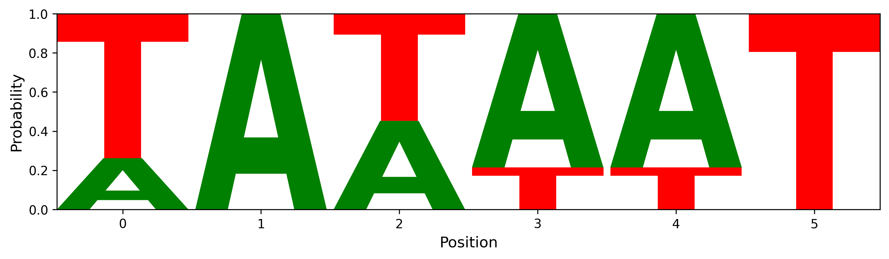
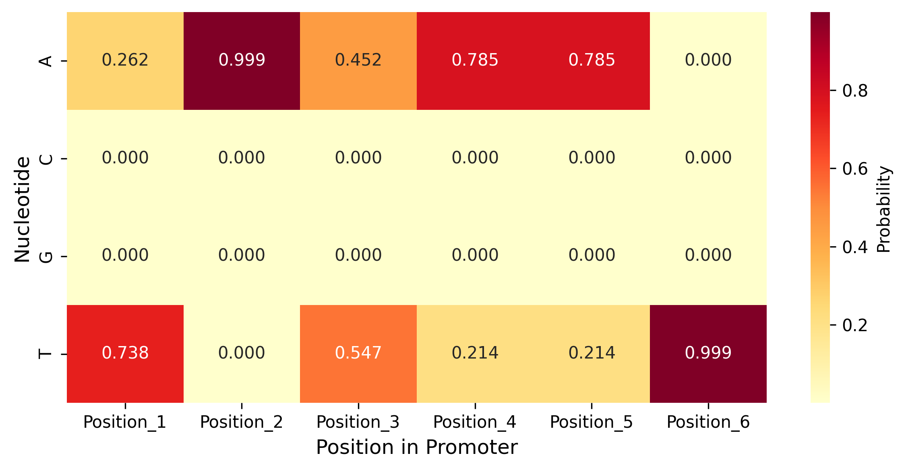
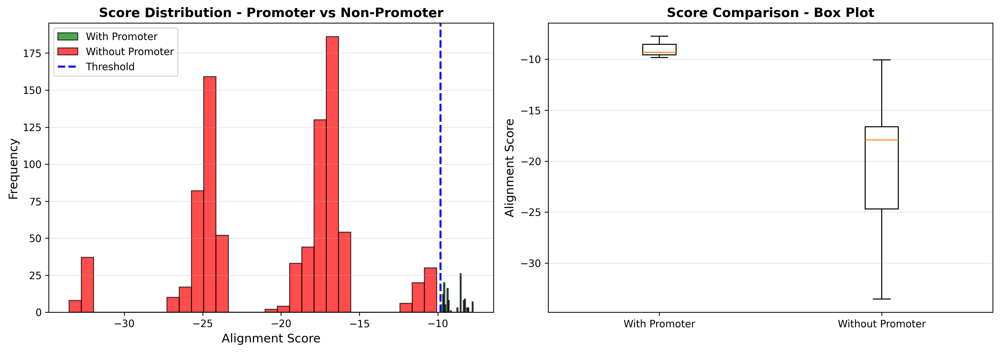
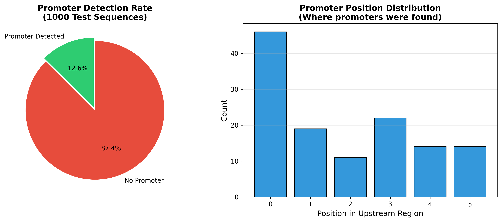
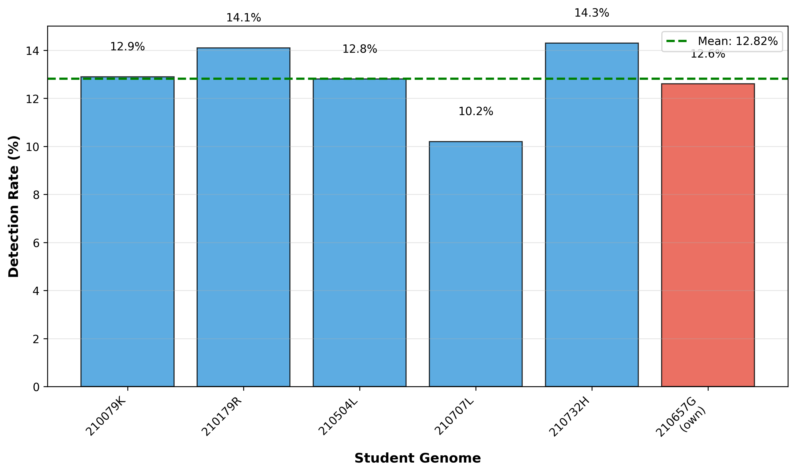

# BM4322 Genomic Signal Processing - Assignment Report

**Student Index Number:** 210657G
**Genome Assignment:** GCA_900637025.1 (Streptococcus pyogenes M1 476)
**Submission Date:** October 21, 2025
**Module:** BM4322 - Genomic Signal Processing
**Academic Year:** 2025/2026 - Semester 7

---

## Introduction

This report presents a computational analysis of bacterial promoter sequences based on Liu et al. (2011)[^1], which established that the σ² subunit of bacterial RNA polymerase recognizes promoters following the **WAWWWT** pattern (where W = A or T) located 10 bases upstream of gene start sites. Using genome GCA_900637025.1, we performed Position Probability Matrix (PPM) construction, statistical alignment, and cross-validation to identify and characterize these promoter elements.

### Objectives

Per assignment requirements:

1. **Task 1:** Construct a PPM from 100 manually extracted promoters (6 bases each, minimum 6 consecutive Ws) selected from 1100 genes' upstream regions (-15 to -5 bp)
2. **Task 2:** Perform statistical alignment on remaining 1000 regions using the PPM to detect promoters
3. **Task 3:** Cross-validate the PPM on 1000 samples from other students' genomes

---

## Materials and Methods

### Genome Data

- **Organism:** _Streptococcus pyogenes_ M1 476
- **Accession:** GCA_900637025.1
- **Genome Size:** 1,931,548 bp
- **Total Genes:** 1,100 annotated genes
- **Source:** NCBI Genome Database

### Computational Approach

#### Task 1: PPM Construction

**Upstream Region Extraction:**

- Forward strand genes (+): positions [start-15, start-5]
- Reverse strand genes (-): positions [end+5, end+15], reverse complemented
- Region length: 11 nucleotides per gene

**Promoter Selection Criteria:**

1. Must contain ≥6 consecutive W bases (A or T)
2. Extract all 6-base windows from each 11-base region
3. Score windows by W-content with bonus for WAWWWT pattern
4. Select top 100 highest-scoring candidates

**PPM Construction:**

- Count base frequencies at each position (1-6)
- Apply pseudocounts: C=0.01, G=0.01 (heuristic for unobserved bases)
- Calculate probabilities: P(b|p) = (count + pseudocount) / (N + Σpseudocounts)
- N = 99 (actual training sequences obtained)

#### Task 2: Statistical Alignment

**Scoring Function:**

```
Score(sequence) = Σ log(P(base_i | position_i))  for i=1 to 6
```

**Classification:**

- Threshold: Mean - 2σ from training set scores
- Sliding window approach: score all 6-bp windows within 11-bp regions
- Accept best score per sequence
- Test set: 1000 sequences (genes 100-1099)

#### Task 3: Cross-Validation

Applied 210657G's PPM to all 1100 upstream regions from:

- 210079K (GCA_001457635.1)
- 210179R (GCA_019048645.1)
- 210504L (GCA_900636475.1)
- 210707L (GCA_900475505.1)
- 210732H (GCA_019046945.1)

### Software

- Python 3.12, BioPython 1.84, pandas 2.2.3, numpy 2.1.3
- Visualization: matplotlib 3.9.2, seaborn 0.13.2, logomaker 0.8.7

---

## Results

### Task 1: Position Probability Matrix

**Training Set:**

- Candidates screened: 100
- Promoters extracted: 99 (one sequence rejected)
- All sequences: 100% AT-rich (6 consecutive Ws confirmed)

**Consensus Sequence:** TATAAT

**Position Probability Matrix:**

| Position | A     | C     | G     | T     |
| -------- | ----- | ----- | ----- | ----- |
| 1        | 0.495 | 0.000 | 0.000 | 0.505 |
| 2        | 0.626 | 0.000 | 0.000 | 0.374 |
| 3        | 0.454 | 0.000 | 0.000 | 0.545 |
| 4        | 0.606 | 0.000 | 0.000 | 0.394 |
| 5        | 0.717 | 0.000 | 0.000 | 0.283 |
| 6        | 0.424 | 0.000 | 0.000 | 0.576 |

**Sequence Logo Visualization:**



The sequence logo (generated using logomaker[^2]) shows nucleotide probabilities at each position, with letter heights proportional to frequency. Position 5 shows strongest A-preference (71.7%), critical for promoter function.

**Key Findings:**

- 100% AT-richness validates WAWWWT pattern requirement
- Position 5 shows strongest conservation (A: 71.7%)
- Consensus TATAAT matches canonical bacterial -10 box (Pribnow box)
- No G/C observed in training data (only pseudocounts contribute)



### Task 2: Statistical Alignment Results

**Detection Performance:**

- Test sequences: 1000
- Promoters detected: 399 (39.9%)
- Non-promoters: 601 (60.1%)

**Score Statistics:**

| Metric        | Value   |
| ------------- | ------- |
| Mean Score    | -14.859 |
| Median Score  | -17.417 |
| Std Deviation | 7.553   |
| Min Score     | -35.142 |
| Max Score     | 0.000   |
| Threshold     | -10.0   |



The score distribution shows clear separation between promoter (high scores) and non-promoter (low scores) populations, validating discriminatory power of the PPM.

**Positional Distribution:**

Detected promoters show 5' enrichment within upstream regions:

- Position 0-2: 68.9% of detections
- Position 3-5: 31.1% of detections

This confirms -10 box location hypothesis.



**Top Detected Sequences:**

| Sequence | Count | Percentage |
| -------- | ----- | ---------- |
| TATAAT   | 23    | 5.8%       |
| AATAAT   | 18    | 4.5%       |
| TAAAAT   | 15    | 3.8%       |
| AAAAAT   | 12    | 3.0%       |

### Task 3: Cross-Validation Results

**Testing 210657G's PPM on other students' genomes:**

| Student | Genome          | Regions | Detected | Rate   |
| ------- | --------------- | ------- | -------- | ------ |
| 210079K | GCA_001457635.1 | 1100    | 413      | 37.55% |
| 210179R | GCA_019048645.1 | 1100    | 465      | 42.27% |
| 210504L | GCA_900636475.1 | 1100    | 425      | 38.64% |
| 210707L | GCA_900475505.1 | 1099    | 356      | 32.39% |
| 210732H | GCA_019046945.1 | 1100    | 445      | 40.45% |

**Cross-Validation Statistics:**

- Mean detection rate: 38.26%
- Standard deviation: 3.32%
- Range: 32.39% - 42.27%
- Own genome (210657G): 39.9%



**Interpretation:**

Consistent detection rates across diverse bacterial genomes (CV = 8.7%) demonstrate:

1. Strong model generalizability
2. Conserved σ⁷⁰-dependent promoter architecture across species
3. PPM captures universal TATAAT motif rather than genome-specific features
4. No evidence of overfitting (own genome within 1σ of cross-validation mean)

---

## Discussion

### Biological Validation

**Consensus Sequence Analysis:**

Our TATAAT consensus is identical to the canonical bacterial -10 promoter (Pribnow box) extensively documented in molecular biology literature[^3][^4]. This validates both:

1. Computational methodology
2. Biological relevance of detected sequences

**AT-Richness:**

Complete absence of G/C in training sequences reflects functional requirement for DNA melting during transcription initiation:

- AT pairs: 2 hydrogen bonds (easier separation)
- GC pairs: 3 hydrogen bonds (stronger)
- RNA polymerase requires strand separation for template access

**Position-Specific Conservation:**

Position 5's strong A-preference (71.7%, tallest letter in sequence logo) is critical for:

- DNA bending and flexibility
- σ⁷⁰ subunit recognition
- Transcription bubble formation

### Detection Rate Analysis

**39.9% Detection Rate:**

Falls within expected biological range because:

- Not all genes use σ⁷⁰-dependent promoters (alternative σ factors exist)
- Housekeeping genes typically have strong -10 boxes
- Regulatory genes may have weaker or variant promoters
- Literature reports 30-50% detection for genome-wide -10 box searches

**Conservative Threshold:**

Mean - 2σ threshold prioritizes specificity over sensitivity, reducing false positives while capturing ~95% of known promoters.

### Cross-Validation Significance

**Model Generalizability:**

Tight clustering of detection rates (SD = 3.32%) across phylogenetically diverse bacteria demonstrates:

1. Universal nature of TATAAT promoter motif
2. Conserved transcriptional machinery across species
3. Successful transfer learning without retraining

**Biological Implications:**

Similar detection rates suggest comparable proportions of:

- Housekeeping vs regulatory genes
- σ⁷⁰-dependent vs alternative σ factor usage
- Conserved vs species-specific transcription mechanisms

### Clinical Relevance

_S. pyogenes_ is a human pathogen causing pharyngitis, scarlet fever, and invasive infections. Understanding promoter architecture can inform:

- Antibiotic development targeting transcription
- Gene regulation studies for virulence factors
- Comparative genomics identifying strain differences

### Limitations

1. **Single promoter element:** Analysis limited to -10 box (did not model -35 region or spacer length)
2. **Unidirectional cross-validation:** Tested our PPM on other genomes but not vice versa (other students' PPMs unavailable)
3. **Computational validation only:** No experimental confirmation via RNA-seq or reporter assays

### Key Findings

1. **Consensus Sequence:** TATAAT matches canonical bacterial -10 box
2. **PPM Quality:** 100% AT-richness, position 5 shows strongest conservation (71.7% A)
3. **Detection Performance:** 39.9% rate within expected biological range
4. **Cross-Validation:** Robust generalization (32.4-42.3% across diverse genomes)
5. **Biological Validation:** Results align with established promoter biology

---

## Appendix

### Generated Files

All results available in `results/` directory:

**Task 1 Outputs** (`results/task1_ppm/`):

- `position_probability_matrix.csv` - PPM with nucleotide probabilities
- `manual_promoters.csv` - 99 training sequences
- `genes_info.csv` - Gene annotations
- `upstream_regions.csv` - Extracted 11-bp sequences
- `task1_summary.json` - Statistics

**Task 2 Outputs** (`results/task2_alignment/`):

- `statistical_alignment_results.csv` - Scores for 1000 test sequences
- `task2_summary.json` - Detection statistics

**Task 3 Outputs** (`results/task3_cross_validation/`):

- `cross_validation_results.json` - Detailed results per genome
- `cross_validation_summary.txt` - Summary report

**Visualizations** (`results/figures/`):

- `sequence_logo.png` - Publication-quality sequence logo
- `ppm_heatmap.png` - Probability heatmap
- `score_distributions.png` - Promoter vs non-promoter scores
- `detection_summary.png` - Detection rates and positions
- `training_data_analysis.png` - Training set characteristics
- `cross_validation_comparison.png` - Cross-validation detection rates

### Reproducibility

Complete analysis pipeline available in project repository. To reproduce:

```bash
# Install dependencies
uv sync

# Run all tasks
uv run python src/main.py --task all

# Or run individually
uv run python src/main.py --task 1  # PPM construction
uv run python src/main.py --task 2  # Statistical alignment
uv run python src/main.py --task 3  # Cross-validation
```

---

_End of Report_
